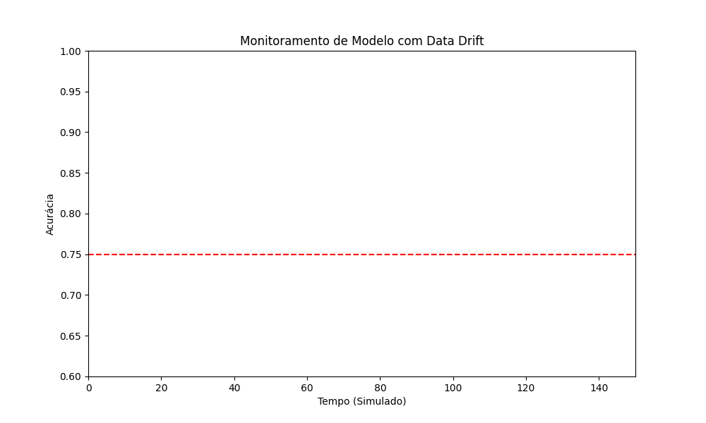

# 📈 Monitoramento de Modelos de Machine Learning: Detecção de Data Drift

[](https://opensource.org/licenses/MIT)

## Visão Geral do Projeto

Este projeto aborda um desafio crítico no ciclo de vida de modelos de Machine Learning em produção: a **detecção de Data Drift**. Data Drift refere-se a mudanças nas distribuições dos dados de entrada ao longo do tempo, que podem levar à degradação do desempenho de um modelo já treinado. O objetivo é implementar um sistema de monitoramento robusto para identificar essas mudanças e garantir a confiabilidade e a acurácia contínua dos modelos em ambientes dinâmicos.

## 🚀 Demonstração

Veja a animação resultante do projeto:

<p align="center">
  
</p>

## Motivação

Modelos de Machine Learning são treinados com base em dados históricos. No entanto, o mundo real está em constante evolução. Fatores como mudanças no comportamento do consumidor, novas tendências, sazonalidade, crises econômicas ou atualizações de sistemas podem alterar a natureza dos dados que o modelo recebe. Sem um monitoramento eficaz, um modelo pode começar a fazer previsões imprecisas, impactando negativamente decisões de negócio e resultados. Este projeto visa mitigar esse risco, fornecendo ferramentas para detectar e visualizar o Data Drift.

## Tecnologias Utilizadas

Para o desenvolvimento deste sistema de monitoramento, foram empregadas as seguintes tecnologias e bibliotecas Python:

* **Python 3.10+**: Linguagem de programação principal.
* **Pandas**: Essencial para manipulação e análise de dados tabulares.
* **NumPy**: Fundamento para operações numéricas eficientes.
* **Matplotlib** e **Seaborn**: Utilizadas para a criação de visualizações estáticas e animações dinâmicas das distribuições de dados.
* **Scipy**: Empregado para testes estatísticos, como o teste de Kolmogorov-Smirnov (KS Test), para comparar distribuições.
* **Scikit-learn**: Fornece utilidades para pré-processamento de dados e outras ferramentas de ML.
* **PIL (Pillow)**: Utilizada indiretamente via `matplotlib.animation.PillowWriter` para exportar a animação como GIF.

## Metodologia

O projeto segue uma metodologia clara para simular, detectar e visualizar o Data Drift:

1.  **Simulação de Dados**:
    * Criação de um conjunto de dados "base" para simular o ambiente de treinamento original do modelo.
    * Geração de dados de "produção" em tempo real, introduzindo intencionalmente pequenas alterações e, em certos momentos, drifts significativos nas distribuições de variáveis-chave.

2.  **Análise Estatística para Detecção de Drift**:
    * **KS Test (Kolmogorov–Smirnov)**: Aplicado para avaliar se as distribuições das variáveis nos dados de produção são estatisticamente diferentes das distribuições nos dados de treinamento.
    * **PSI (Population Stability Index)**: Calculado para quantificar a magnitude da mudança na distribuição de cada variável, fornecendo um indicador numérico da estabilidade.

3.  **Visualização Dinâmica**:
    * Criação de gráficos animados (histogramas e KDEs) que mostram a evolução das distribuições das variáveis ao longo do tempo.
    * Implementação de alertas visuais (e.g., pontos e texto) no gráfico quando os limites de Data Drift são excedidos, facilitando a identificação rápida de anomalias.

## Estrutura do Projeto:

Este repositório está organizado da seguinte forma:

* `media/`: Contém os arquivos de mídia gerados pelo projeto.
    * `monitoramento_drift.gif`: Animação GIF que visualiza a detecção de Data Drift ao longo do tempo.
* `notebooks/`: Contém os notebooks Jupyter que documentam o processo de desenvolvimento e simulação.
    * `Monitoramento_Modelo_Data_Drift.ipynb`: Notebook principal que implementa a simulação de dados, a detecção de drift (KS Test, PSI) e a criação da visualização animada.
* `README.md`: Este arquivo, que fornece uma visão geral completa do projeto.
* `LICENSE.md`: Arquivo contendo a licença do projeto (MIT).
* `requirements.txt`: Lista de todas as dependências Python necessárias para o projeto.

## Instalação e Uso

Para configurar e executar este projeto em seu ambiente local, siga os passos abaixo:

1.  **Clone o Repositório**:
    ```bash
    git clone <URL_DO_SEU_REPOSITORIO>
    cd <nome_do_seu_repositorio>
    ```
    (Substitua `<URL_DO_SEU_REPOSITORIO>` e `<nome_do_seu_repositorio>` pelos valores corretos).

2.  **Crie a Estrutura de Diretórios**:
    Certifique-se de que as pastas `dados`, `media` e `notebooks` existam na raiz do seu projeto.
    ```bash
    mkdir dados media notebooks
    ```

3.  **Posicione os Arquivos**:
    * Coloque o notebook `Monitoramento_Modelo_Data_Drift.ipynb` na pasta `notebooks/`.
    * O GIF `monitoramento_drift.gif` será salvo automaticamente na pasta `media/` após a execução do notebook.

4.  **Crie e Ative um Ambiente Virtual (Recomendado)**:
    É altamente recomendável usar um ambiente virtual para gerenciar as dependências do projeto.

    ```bash
    # Usando conda
    conda create -n drift_env python=3.10
    conda activate drift_env

    # Ou usando venv
    python -m venv venv
    .\venv\Scripts\activate   # No Windows PowerShell
    source venv/bin/activate  # No Linux/macOS
    ```

5.  **Instale as Dependências**:
    Crie um arquivo `requirements.txt` na raiz do seu projeto com o seguinte conteúdo:

    ```
    numpy>=1.20
    pandas>=1.3
    matplotlib>=3.4
    seaborn>=0.11
    scipy>=1.7
    scikit-learn>=1.0
    Pillow>=9.0
    ```

    Com o ambiente ativado, instale as bibliotecas:
    ```bash
    pip install -r requirements.txt
    ```

6.  **Execute o Notebook**:
    Inicie o Jupyter Notebook na raiz do seu projeto:
    ```bash
    jupyter notebook
    ```
    Navegue até a pasta `notebooks/` e execute o notebook `Monitoramento_Modelo_Data_Drift.ipynb` para simular o drift e gerar a animação.

## Resultados e Impacto

Este projeto demonstra graficamente a importância do monitoramento contínuo de modelos. A animação gerada no `media/monitoramento_drift.gif` ilustra claramente como as distribuições de dados podem mudar ao longo do tempo, e como os alertas de drift se manifestam visualmente quando limites pré-definidos são atingidos.

A capacidade de detectar e visualizar o Data Drift de forma proativa é fundamental para:

* **Manter a Performance do Modelo**: Identificar a necessidade de re-treinamento ou ajuste do modelo antes que sua acurácia degrade significativamente.
* **Reduzir Riscos de Negócio**: Evitar decisões erradas baseadas em previsões obsoletas.
* **Otimizar o Ciclo de Vida do ML**: Integrar o monitoramento como parte essencial de um pipeline MLOps.

## Licença

Este projeto está licenciado sob a Licença MIT. Para mais detalhes, consulte o arquivo [LICENSE](LICENSE.md) na raiz do repositório.

## Contato

Sinta-se à vontade para entrar em contato se tiver alguma dúvida, sugestão ou quiser discutir o projeto:

* **Nome**: Flávio Henrique Barbosa
* **LinkedIn**: [Flávio Henrique Barbosa | LinkedIn](https://www.linkedin.com/in/fl%C3%A1vio-henrique-barbosa-38465938)
* **Email**: flaviohenriquehb777@outlook.com
